Malware

## Malware unpacking

Lethic packer is multi-staged.
It loads the unpacker in chunks in the stack while also saving pointers to certain library functions. Eventualy it starts using the heap as well to execute code.

For unpacking the first stage was using a free resource 'unpac.me' then analyzing the malware in Ghidra. The decompilation is documented in the ghidra file.  In this section we will explore manual decompilation of the malware.

The project used qiling framework to analyse the packed executable. 

## Unpacking

### First steps

The project base was inspired from the open-source project documented at: 
(https://www.blueliv.com/cyber-security-and-cyber-threat-intelligence-blog-blueliv/using-qiling-framework-to-unpack-ta505-packed-samples/)

The first stages to unpack the malware is to find the functions that are not yet implemented in qiling and manually set an API for them. Although powerful, the qiling framework still does not have implemented all windows included dlls functions.

### Anti-Emulation techniques used

The malware included some \_getc() to stop potential automatic unpackers. Although we can redirect the pipes for stdin, an easier approach is to send some new lines as input. Thus executing the quling emulation is done by: 
```
echo "\n\n\n\n\n\n\n\n\n" |./qil.py
```

The first anti-emulation technique found was allocation then freeing of memory in a while loop.
 Although powerful, Ghidra decompiler was found not able to hold in memory the full  main function of the malware due to the big number of MOV instructions used in unpacking. However a ghidra decompilation without full analysis will be explained briefly below.
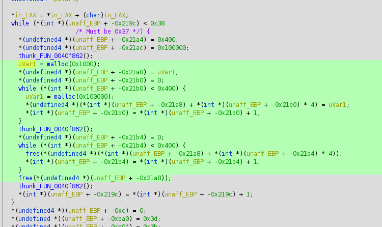
The section of code, allocated 4KB+ 1 GB of memory  then frees it. In a normal environment the execution of the code will not take too much time since the allocation and deallocation is mostly run at user level, without transitions to kernel level.
The entire section can be skipped. Since this is part of the static code, we can patch it directly in qiling by telling it to look for the bytes of the CMP instruction and change the compared value to 0.

A flow graph of instructions can also be seen in Cutter however the functions were not manually labeled in this case. Cutter is a reverse engineering software built around the rizin fork of radare2.

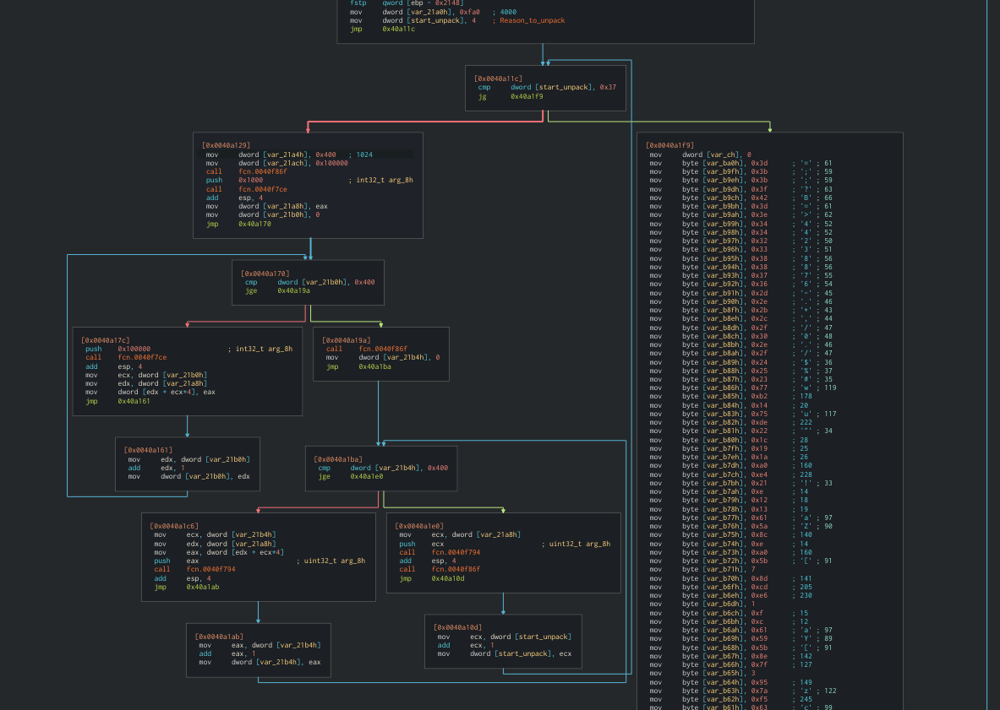

Although Ghidra integrates an instruction flow graph it's less pleasant to look in this version.

### Stage2

Once past the memory allocations, the program jumps to the stack to continue the execution. In this case, we will use a mixture of static and dynamic analysis. After running for a while, the emulator seemed "stuck" in a loop. 

In this case we will dump the entire stack in order to see if we can skip more than one instruction.
After dumping the stack and loading it in Ghidra, we can identify the loop.
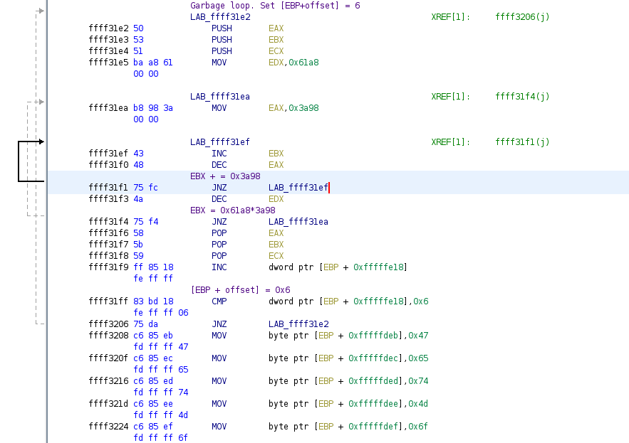
After some analysis, we can identify that the loop executes untill whatever is at the address [EBP+offset] equal to 6.

This instruction will be patched live. An fix amateur was implemented by skipping 5 bytes once reaching the first JNZ, since the time it takes to execute the rest of the loop is small enough.

Next loop involves a system call:
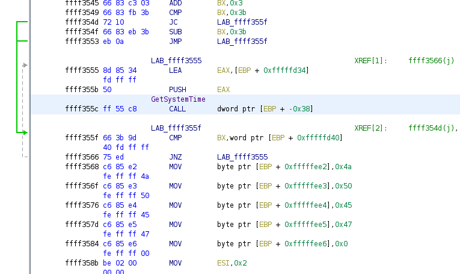
To get past it, a simple register overwritting was used.  BX was set to the value of [EBP+offset] before the comparison.

However the project hit a wall when the malware tries to call FindResourceA. (note little Endian should used at the last line of printing)
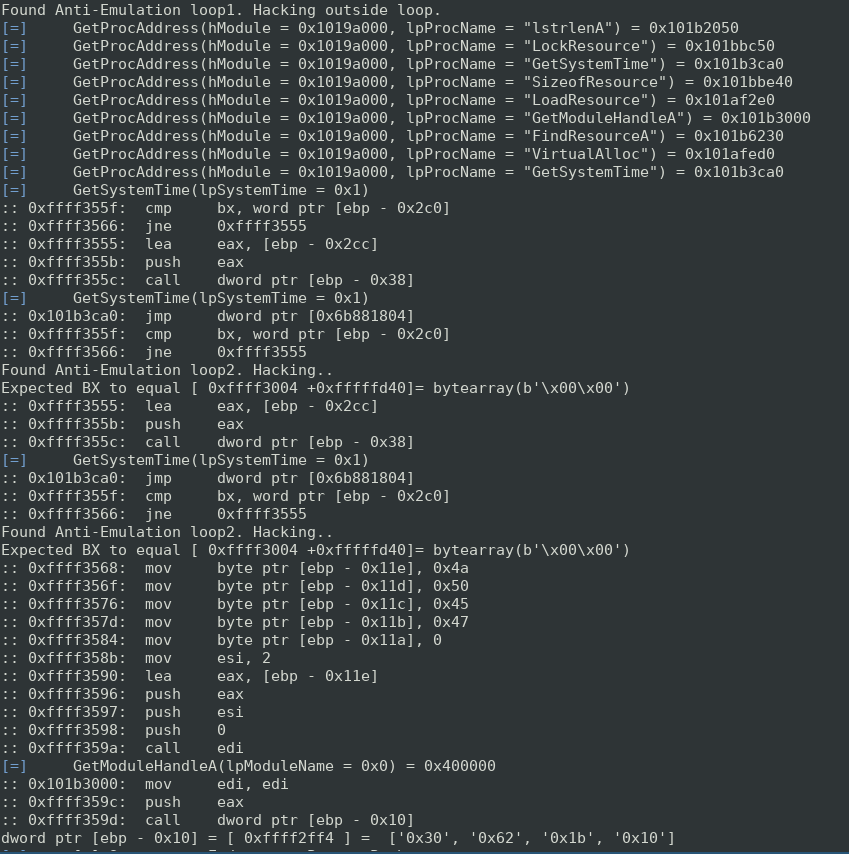

The bad news is the implementation in qiling of FindResourceA is:
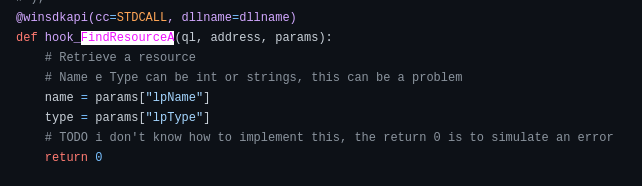
This makes running the rest of the unpacking unfeasible since the malware uses the information it recives from the function. Manual creation of the function is needed. From inspection, the called function should search from a bitmap image at the Handle of the program its self. It had been seen in manual inspection that in previous instructions, the program writes JPEG somewhere into the memory.
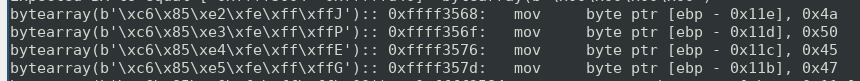
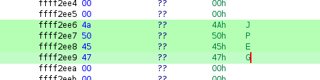

However what is curious is that the memory is mapped but qiling refuses to call the section as seen below:
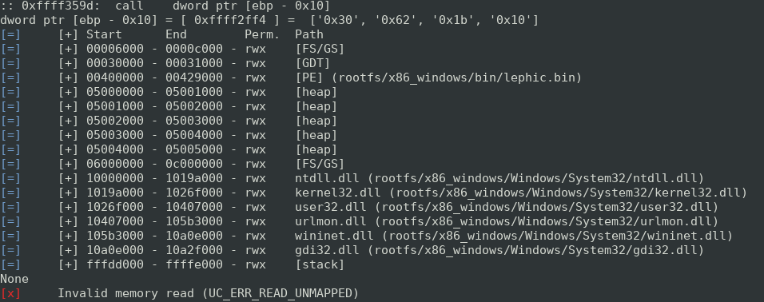

The unpacking project in qiling finished here since we do not know how microsoft implements the function and at what offset will it return after finding the 'JPEG' string (as documented, a HANDLE). After the address was found, the program will eventually deobfuscates some data and loads it in the heap then calls it. Some attempts were made to guess the address however garbage code resulted:
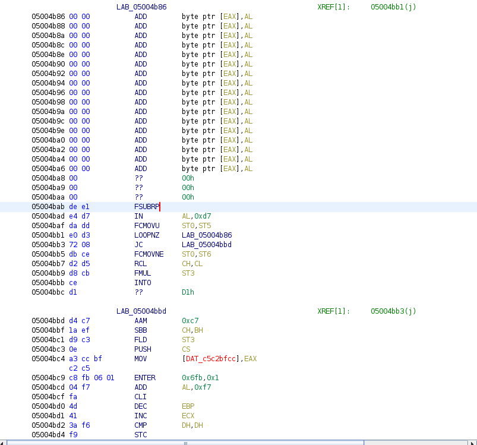

## Memory dump

After running the malware in a virtual machine, the entire memory was dumped.

Using volatility with the malfind plugin, we can see the program locates certain unusual data in explorer.exe such as:
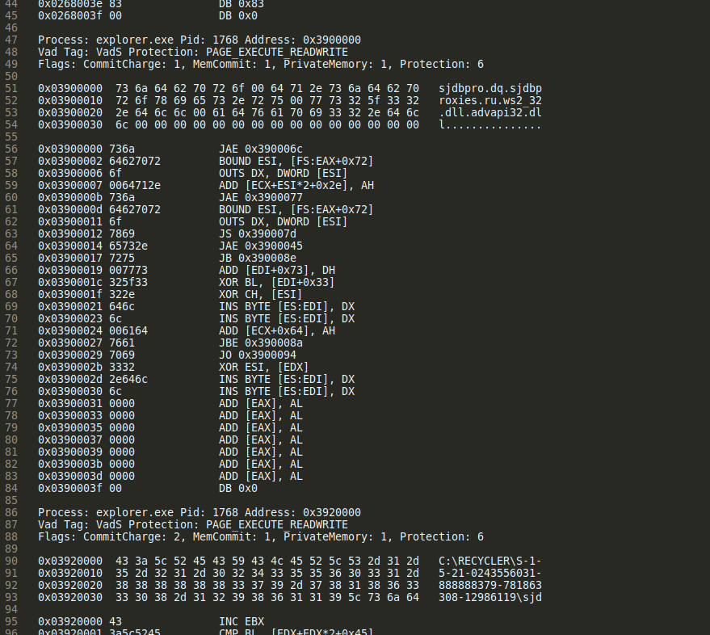
The data shown is expected, as later defined at the disassembly of the malware, sjdbpro that will be the malware name on system but also the site it connects to. The 2'nd listing also shows the full directory path of the malware.


In the frist part, we can identify the site the malware connects to but also 2 dlls required further in what we will see later as an injected Thread in explorer.exe (as seen in the disassembly of the malware, it connects to the site using the mentioned dlls).
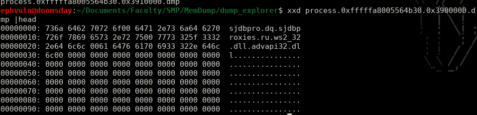


After extracting the data from volatility malfind, we can inspect it further in hexdump. For example here we can see the full path of the malware persistent location of execution written as a string in explorer.exe.
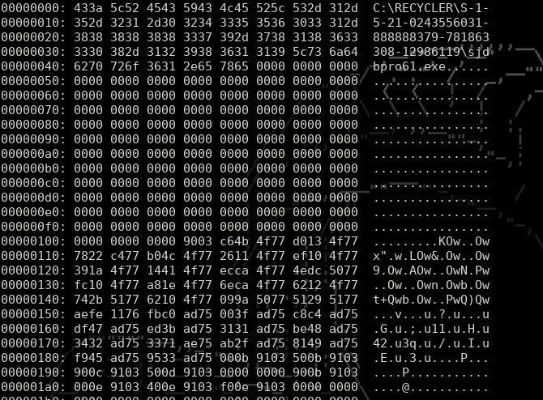

