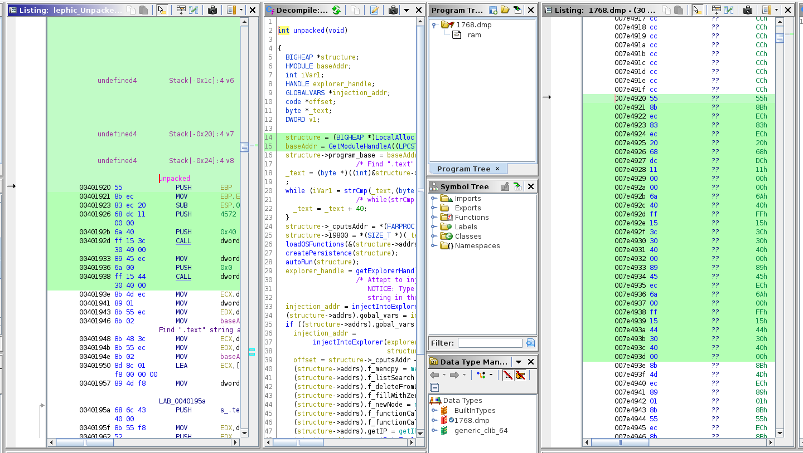

## Malware analysis (Win32.Lethic):

### Files:

*MALWARE CAN BE FOUND AT https://github.com/ytisf/theZoo/tree/master/malwares/Binaries/Win32.Lephic *

- Malware.md - Documentation for manual malware unpacking
- lephic_Unpacked_analyzed.bin.gzf - Ghidra project. Comments and intuitive variabile names of decompilation
- malfind_results.txt - Results of volatility malfind on explorer.exe 
- Memory_section_of_stack__0xfffdd000-0xffffe000.bin.gzf - Dump of the stack after some unpacking
- qil.py - Python script to unpack the malware using the qiling framework.

Example of the malware extracted with unpacme and decompiled (left) and a memory dump of explorer.exe having the same code injected (right).

### Software used:

- Quiling Framework:
https://docs.qiling.io/en/latest/install/

- Ghidra:
https://ghidra-sre.org/

- Volatility:
https://www.volatilityfoundation.org/26

### Similar projects:

- "Using Qiling Framework to Unpack TA505 packed samples"
https://www.blueliv.com/cyber-security-and-cyber-threat-intelligence-blog-blueliv/using-qiling-framework-to-unpack-ta505-packed-samples/

- "Reversing WannaCry" - using ghidra to decompile malware:
https://www.youtube.com/watch?v=Sv8yu12y5zM

- UnpacMe - service for unpacking malware (video explaining how the service started):
https://www.youtube.com/watch?v=FctDptnYukQ

### Books recomandations:

- "Malware Analyst’s Cookbook and DVD  Tools and Techniques for Fighting Malicious Code" - Michael Hale Ligh, et. al.

- "Practical Malware Analysis" - Michael Sikorski and Andrew Honig

- "Practical Reverse Engineering" - Bruce Dang, et. al.
